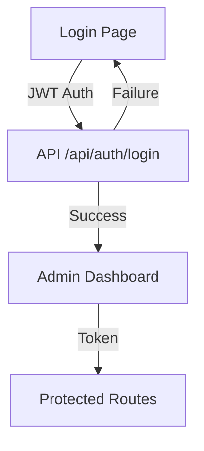
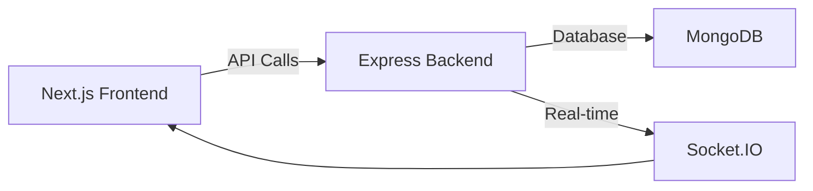

# Next.js Admin Website Architecture Plan

## Overview
This document outlines the architecture for the Next.js admin website that will complement the existing React Native mobile application.

## Current System Analysis

### Existing Components
- **React Native Admin Screens**: `AdminDashboardScreen.js`, `AdminVendorApplicationsScreen.js`
- **Backend API**: Basic admin endpoint at `/api/admin/dashboard` (currently mock data)
- **Authentication**: JWT-based auth middleware already implemented
- **Database**: MongoDB with Mongoose models

### Key Features to Port/Extend
1. Admin Dashboard with analytics
2. Vendor application management
3. Inventory monitoring
4. Bulk operations
5. User management
6. System analytics

## Proposed Architecture

### 1. Project Structure

```
admin-web/
├── public/                  # Static assets
├── src/
│   ├── app/                # Next.js 14+ app router
│   │   ├── (auth)/          # Authentication routes
│   │   ├── (admin)/         # Admin dashboard routes
│   │   ├── api/             # API routes (proxy to backend)
│   │   └── layout.tsx       # Main layout
│   ├── components/         # Reusable UI components
│   │   ├── admin/           # Admin-specific components
│   │   ├── ui/              # UI primitives (buttons, cards, etc.)
│   │   └── layout/          # Layout components
│   ├── lib/                # Utilities and services
│   │   ├── api/             # API service layer
│   │   ├── auth/            # Auth utilities
│   │   ├── hooks/           # Custom hooks
│   │   └── utils/           # Utility functions
│   ├── store/              # State management (Zustand)
│   ├── styles/             # Global styles and themes
│   ├── types/              # TypeScript types
│   └── constants/          # App constants
├── .env.local              # Environment variables
├── next.config.js          # Next.js configuration
├── package.json            # Dependencies
└── tsconfig.json           # TypeScript config
```

### 2. Technology Stack

**Frontend:**
- Next.js 14+ (App Router)
- React 18+
- TypeScript
- Tailwind CSS (for styling)
- Zustand (for state management)
- Axios (for API calls)
- React Hook Form (for forms)
- ShadCN UI (for accessible components)

**Backend Integration:**
- Proxy API routes to existing Express backend
- JWT authentication
- Real-time updates via Socket.IO

**Deployment:**
- Vercel (for Next.js frontend)
- Same backend infrastructure
- Shared database

### 3. Key Features Implementation

#### Authentication Flow


#### Admin Dashboard
- **Overview Tab**: Quick stats, recent activity, quick actions
- **Brands Tab**: Brand management with approval workflow
- **Inventory Tab**: Stock monitoring and alerts
- **Bulk Operations**: CSV upload/download, bulk edits
- **Analytics**: Charts and reports
- **Settings**: System configuration

#### Data Flow


### 4. API Integration Strategy

**Approach 1: Direct API Calls**
- Next.js frontend calls Express backend directly
- CORS configured on backend
- JWT tokens for authentication

**Approach 2: Next.js API Proxy**
- Create `/app/api` routes that proxy to backend
- Better security, can add additional logic
- Recommended approach

### 5. State Management

**Zustand Stores:**
- `useAuthStore` - Authentication state
- `useAdminStore` - Admin dashboard data
- `useVendorStore` - Vendor applications
- `useInventoryStore` - Inventory data

### 6. UI/UX Considerations

- **Responsive Design**: Mobile-first approach
- **Dark/Light Mode**: Theme switching
- **Accessibility**: WCAG compliance
- **Performance**: Code splitting, lazy loading
- **Internationalization**: Multi-language support

### 7. Security Considerations

- **Authentication**: JWT with refresh tokens
- **Authorization**: Role-based access control
- **Data Validation**: Both client and server-side
- **Rate Limiting**: Protect against abuse
- **CORS**: Properly configured
- **CSRF Protection**: For forms

### 8. Deployment Strategy

**Phased Approach:**
1. **Phase 1**: Basic admin dashboard with core features
2. **Phase 2**: Advanced analytics and reporting
3. **Phase 3**: Real-time features and notifications
4. **Phase 4**: Optimization and performance tuning

### 9. Migration Plan from React Native

**Component Mapping:**
- `AdminDashboardScreen.js` → `/app/(admin)/dashboard/page.tsx`
- `AdminVendorApplicationsScreen.js` → `/app/(admin)/vendors/page.tsx`
- Redux slices → Zustand stores
- React Navigation → Next.js routing

### 10. Development Roadmap

**Week 1-2: Setup & Core Features**
- Project setup and configuration
- Authentication system
- Basic dashboard layout
- API integration layer

**Week 3-4: Main Features**
- Vendor management
- Inventory monitoring
- Bulk operations
- Basic analytics

**Week 5-6: Advanced Features**
- Real-time updates
- Advanced reporting
- User management
- System settings

**Week 7-8: Testing & Deployment**
- Comprehensive testing
- Performance optimization
- Security audit
- Production deployment

## Success Metrics

1. **Feature Parity**: All mobile admin features available on web
2. **Performance**: Lighthouse score > 90
3. **User Adoption**: 80% of admin users prefer web interface
4. **Reliability**: 99.9% uptime
5. **Security**: Zero critical vulnerabilities

## Risks and Mitigation

1. **Integration Issues**: Thorough API testing
2. **Performance Bottlenecks**: Load testing and optimization
3. **Security Vulnerabilities**: Regular security audits
4. **User Resistance**: Training and documentation
5. **Scope Creep**: Strict feature prioritization

## Next Steps

1. Create Next.js project structure
2. Set up authentication system
3. Implement core admin dashboard
4. Integrate with existing backend APIs
5. Test and validate functionality